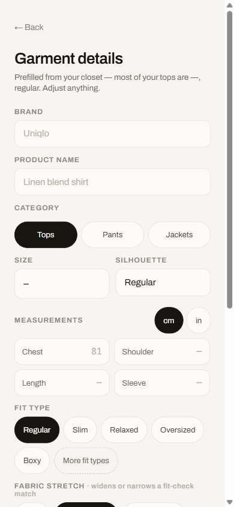
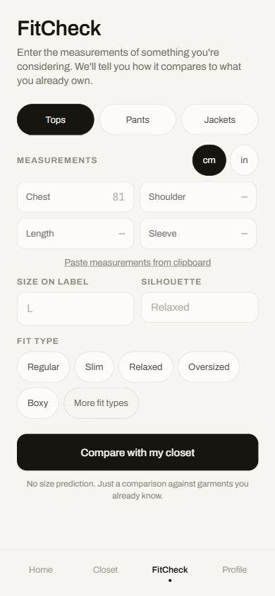
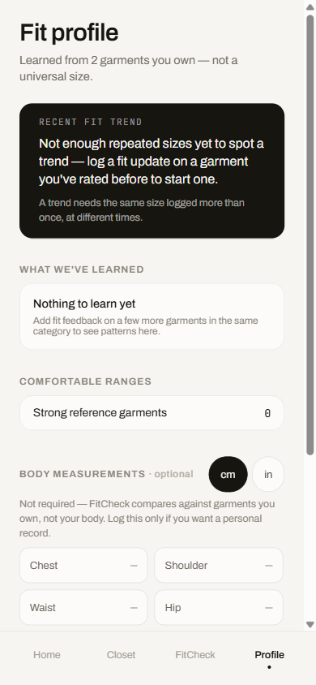

# FitCheck

FitCheck is a personal fit-memory app for clothes. You log the garments you
own — with the measurements that actually matter for that garment's category,
not a universal spec sheet — and how they fit. When you're considering a new
piece, FitCheck compares its measurements against what's already in your
closet and tells you the closest match, the exact differences, and what that
means in plain language. No sizing predictions, no match percentages, no
population averages — just your own data, honestly presented.

It's fully offline: everything lives in a local SQLite database on your
device. There's no account, no backend, and no network calls anywhere in the
app.

## Screenshots

<p align="center">
  
  
  
</p>

## Why FitCheck exists

Online size charts and "true to size" reviews assume your body matches some
reference customer. FitCheck doesn't try to predict your size from measurements
alone — it anchors every comparison to a garment you already own and know the
fit of, and shows you the differences from there. See
[`DESIGN_GUIDELINES.md`](DESIGN_GUIDELINES.md) for the full design philosophy,
and [`docs/spec.md`](docs/spec.md) for the original product/architecture spec.

## Getting started

**Prerequisites:** Node.js 18+, npm, and either an Android/iOS device or
emulator (or a web browser, via Expo's web target).

```bash
npm install
npm start        # opens Expo dev tools — scan the QR code with Expo Go, or:
npm run android  # run on a connected Android device/emulator
npm run ios      # run on a connected iOS device/simulator (macOS only)
npm run web      # run in a browser
```

This project targets **Expo SDK 57** (see [`AGENTS.md`](AGENTS.md) — the SDK
has changed significantly across versions, so check the
[versioned Expo 57 docs](https://docs.expo.dev/versions/v57.0.0/) rather than
generic/latest Expo docs when making changes).

### Building a release APK locally

FitCheck builds a signed, sideloadable APK purely from source with no cloud
dependency (no Expo account or EAS needed):

```bash
npx expo prebuild -p android
cd android && ./gradlew assembleRelease
# -> android/app/build/outputs/apk/release/app-release.apk
```

The APK targets `arm64-v8a` and `armeabi-v7a` (nearly all physical phones) and
has R8 minification and resource shrinking enabled. Bump `expo.version` and
`expo.android.versionCode` in `app.json` for every release.

Release signing (`plugins/withReleaseSigning.js`) looks for `keystore.properties`
and a keystore under `keystore/`; if neither is present it falls back to debug
signing with a warning, so a fresh clone builds without any extra setup.

## Backing up your closet

Because everything lives only on your device, uninstalling the app or losing
the phone loses the closet. **Profile → Back up your closet** exports it and
restores it:

- **Export backup** writes a single JSON file (garments, their full fit
  history, and your body-measurement log) and opens your system share sheet,
  so you choose where it goes — Files, a cloud drive, email. FitCheck itself
  never uploads it anywhere.
- **Import backup** reads a file you pick, validates it, and asks before doing
  anything.

Things worth knowing before you rely on it:

- **Import replaces, it doesn't merge.** Restoring swaps your current closet
  for the file's contents (the confirmation dialog says so, with counts). It's
  all-or-nothing: if anything fails partway, your existing closet is left
  untouched.
- **Photos are not included.** The file holds the path a photo had on the
  device that exported it, which is meaningless on another device or after a
  reinstall. On import, any photo that isn't actually present on the current
  device is dropped rather than left as a broken reference. Measurements, fit
  history and everything else carry over.
- **Invalid files are rejected, not repaired.** A file with an unknown
  category, a zero/negative measurement, a garment missing its brand/name/size
  or all measurements, duplicate ids, or a newer format version is refused
  with an explanation. FitCheck never fills in a value the file didn't
  contain.

The file format is defined and validated in
[`src/utils/backupFormat.ts`](src/utils/backupFormat.ts).

## Testing

```bash
npm test            # everything
npm run typecheck   # tsc --noEmit
```

There are two Jest projects (see [`jest.config.js`](jest.config.js)):

- **`unit`** — plain `ts-jest` for code with no React Native imports: the
  comparison engine, unit conversion, `hydrate`, and the backup file
  format/validator.
- **`screens`** — [`jest-expo`](https://docs.expo.dev/develop/unit-testing/) +
  `@testing-library/react-native`. These render the real `<App />` and drive it
  like a user (tap, type, confirm dialogs), covering Closet, Add/Edit garment,
  FitCheck and Result, Garment detail, and Export/Import. Only native
  boundaries are faked — SQLite (an in-memory stand-in in
  `src/screens/__tests__/fakeDb.ts`), fonts, and the file picker/share
  sheet — so the store, engine and screens under test are the real code.

The tests encode the rules in [`DESIGN_GUIDELINES.md`](DESIGN_GUIDELINES.md)
that are easy to regress: measurements never pre-filled or inferred, required
fields rejected with the draft kept, empty states that name their real cause,
and appended (never overwritten) fit history. They have not been run on
physical devices or with a screen reader — see the accessibility note in
[Status](#status).

## Project structure

- `src/engine/compare.ts` — the deterministic fit-comparison engine (no ML,
  no network — just weighted measurement-zone tolerances, fabric-stretch
  scaling, and a transparent confidence score)
- `src/store.tsx` — app state, persistence orchestration, and screen routing
- `src/db/` — local SQLite schema and queries
- `src/data/` — category/measurement-zone constants and derived data helpers
- `src/screens/` — one file per screen (tests in `__tests__/`)
- `src/components/` — shared UI primitives
- `src/utils/` — units conversion, motion constants, photo storage, and
  backup export/import (`backup.ts` for the picker/share I/O,
  `backupFormat.ts` for the pure file format + validation)

## Status

FitCheck is a personal project being published for anyone who finds it
useful, not a maintained product with SLAs. See
[`docs/design-history/`](docs/design-history/) for the design/planning notes
this project was built from, and the open items being worked through before
and after this release.

Known limitations:

- Backups don't include photos, and import replaces the closet rather than
  merging (see [Backing up your closet](#backing-up-your-closet)).
- The automated tests fake the native layer. The real file picker, share sheet
  and SQLite paths (`src/utils/backup.ts`, `src/db/index.ts`) haven't been
  exercised by tests, and nothing has been run with TalkBack/VoiceOver — labels
  and roles are in place, but manual device testing is still worth doing.

## License

MIT — see [`LICENSE`](LICENSE).
